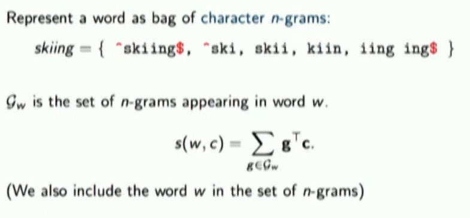
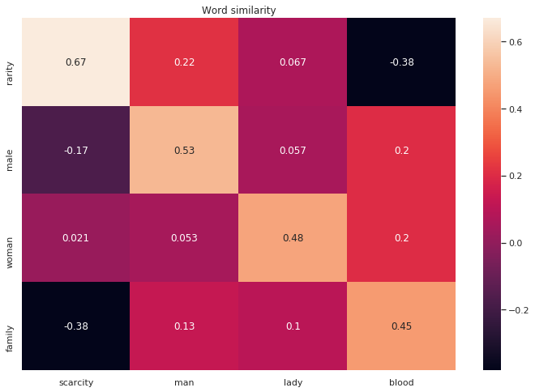

## Subword Word Embedding
This is a modularized implementation of [Enriching Word Vectors with Subword Information](https://www.aclweb.org/anthology/Q17-1010.pdf)  

### Why bother using this when you got [FastText](https://github.com/facebookresearch/fastText)?   
Sometimes when working in closed-domain contexts, you need a fresh embedding module for your model that takes in new words that the pretraining does not have, as well as a fresh flow of gradients for the unique tasks your model need to handle.  
So go ahead... copy this module and paste it into your model.  

### Explanation  
Essentially, the model handles OOV words using subwords.  
Each word is represented as a bag of character n-gram words (plus the full word itself).  
Facebook's pretraining outperforms other pretrained popular word embeddings in classical tasks.  

## Usage
The train file demonstrate a general use case for the model.  
`python train.py`   
Generally, the results make sense.    

## References
https://vimeo.com/234958672  
https://www.aclweb.org/anthology/Q17-1010/  
http://christopher5106.github.io/deep/learning/2020/04/02/fasttext_pretrained_embeddings_subword_word_representations.html 

